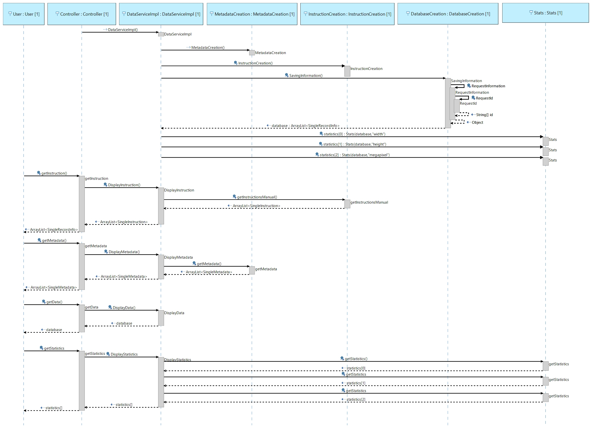

# ProgrammingProject2k20
Exam project for the object programming course

## Table of contents
* [Introduction](Introduction)
* [The models used](The_models_used)
* [Technologies](Technologies)
* [Launch](Launch)
* [How it works](How_it_works)

## Introduction
The designed application is aimed to show data and statistics on twitter posts containing images. The user can apply the same commands on a sample of all the data, by using filters.

## How it works

How the app works can be divided in two main parts:
1. to download the information from Twitter;
2. to show what the user requested;

### To download
When the app is launched, it automatically downloads all the tweets, from Twitter, that are represented in a file with their ids.
If the file isn't found the user sees a message error. Each tweet is contained in a Record that is composed of the most important informations and all togheter composed the database. After this, the general stats about the fields "height", "width" and "megapixel" are calcuted and stored in an ArrayList of variabiles Stats.

### To show
After the inizialization, the user can insert some different roots (each root provides to show different informations from the database)
| Root | Method | What the user sees | What the user has to add in the body |
|---------|---------|---------|-------|
| /GetInstructions | GET | The user sees a simply manual of how the app works | |
| /GetMetadata | GET | The user sees the alias used for a variabile, the type and te meaning | |
| /GetStats | GET | The user sees all the stats calculated on the all set of data | |
| /GetData | GET | The user sees all the tweets downloaded from Twitter | |
| /GetData | POST | The user sees the Tweets that satisfy the filter added by the user | A correct filter |
| /GetFieldStats | GET | The user sees the stats of a particular field calculated using the all databse | |
| /GetFieldStats | POST | The user sees the stats of a particular field calcutaed using the records that satisfy the filter | A correct filter |

A very important part is to analize the filter that the user adds, that is always made when a Request requires a body.
The operation is automatically done by the application analizing each carachter that is been insered. If there are some problem, the application understands which type of error is in the filter and gives back a message to the user.
Otherwise, the filter is convert in a variabile of type TotalFilters that is composed by a macroperator and an ArrayList of filters.
After that, the varibile TotalFilters is used to understand which type of filtering the system has to do. With it the records of database will be choiced. So the request wil be done only with the tweets that satisfy the filter/s.

## Launch

## Technologies
* [Eclipse](https://bulldogjob.com/news/449-how-to-write-a-good-readme-for-your-github-project)
* [Spring Boot]
* [Maven]

## Code Examples
To generate lorem ipsum use special shortcode: `SpringApplication.run(Esame2k20Application.class, args);`
