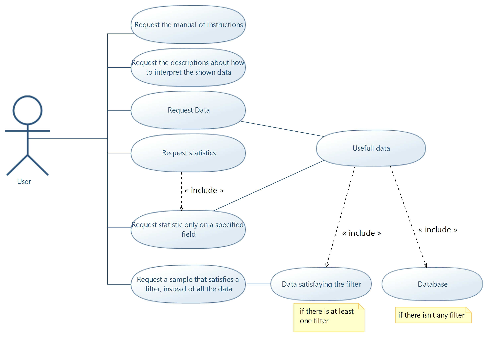
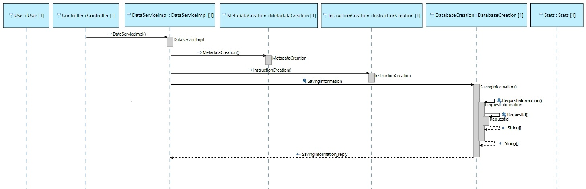
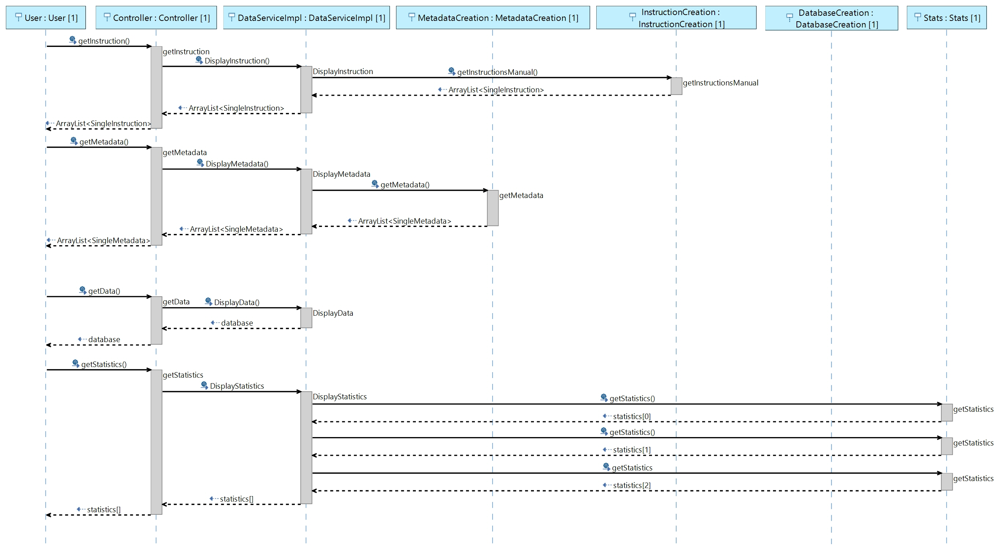
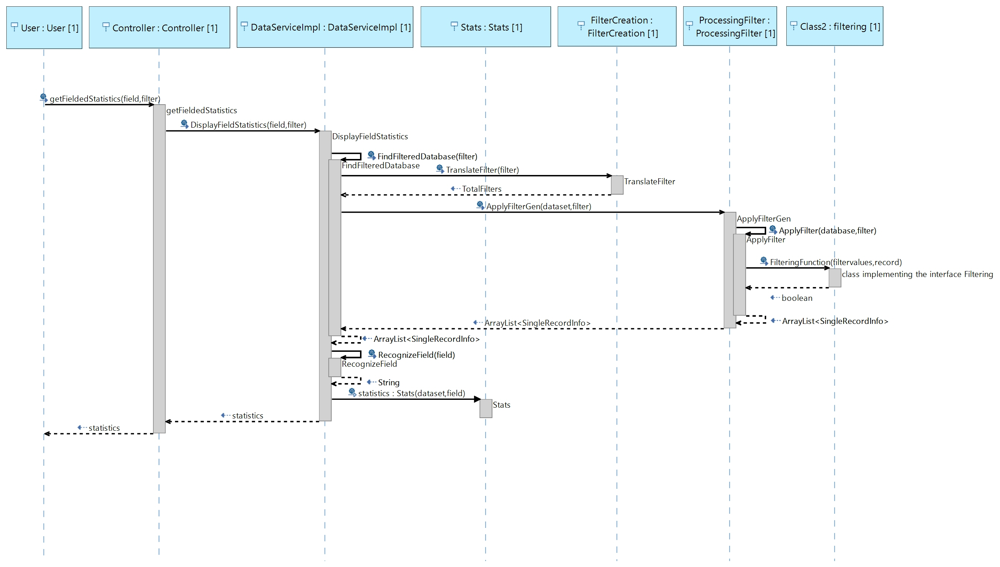

# ProgrammingProject2k20
Exam project for the object programming course

## Table of contents
* [Introduction](#Introduction)
* [How it works](#How-it-works)
* [Packages and classes](#Packages-and-classes)
* [Java language and Object Oriented Programming: how the program exploits their capabilities](#Java-language-and-Object-Oriented-Programming:-how-the-program-exploits-their-capabilities)
* [Technologies](#Technologies)

## Introduction
The designed application is aimed to show data and statistics on twitter posts containing images. The user can apply the same commands on a sample of all the data, by using filters.

## How it works
The use case diagrams show what the user and the system do:

How the app works can be divided in two main parts:
1. to download the information from Twitter;
2. to show what the user requested;

### To download
When the app is launched, it automatically downloads all the tweets, from Twitter, that are represented in a file with their ids.
If the file isn't found the user sees a message error. Each tweet is contained in a Record that is composed of the most important informations and all togheter composed the database. After this, the general stats about the fields "height", "width" and "megapixel" are calcuted and stored in an ArrayList of variabiles Stats.

### To show
After the inizialization, the user can insert some different roots (each root provides to show different informations from the database)
| Root | Method | What the user sees | What the user has to add in the body |
|---------|---------|---------|-------|
| /GetInstructions | GET | The user sees a simply manual of how the app works | |
| /GetMetadata | GET | The user sees the alias used for a variabile, the type and te meaning | |
| /GetStats | GET | The user sees all the stats calculated on the all set of data | |
| /GetData | GET | The user sees all the tweets downloaded from Twitter | |
| /GetData | POST | The user sees the Tweets that satisfy the filter added by the user | A correct filter |
| /GetFieldStats?field="<param>" | GET | The user sees the stats of a particular field calculated using the all databse | |
| /GetFieldStats?field="<param>" | POST | The user sees the stats of a particular field calcutaed using the records that satisfy the filter | A correct filter |

A very important part is to analize the filter that the user adds, that is always made when a Request requires a body. It has to respect some operators and a particular format shown in the table below:
| Operator | Utility | Value format | Applicable fields |
|-------|------|--------|------|
| "$in" | to see the tweet that contains almost one of the hashtags added                    |[val,...] |"hashtags[]"
|"$not" | to see only the tweet that don't contain noone of the hashtags added               |[val,...] |"hashtags[]"
|"$nin" | to see the tweet that don't have almost one of the hashtags                        |[val,...] |"hashtags[]"
|"$gt"  | to see the post that have a field with a number bigger than the value added        | val      |"hashtags[]","height","width","megapixel"
|"$gte" | to see the post that have a field with a number bigger or equal than the value added | val    |"hashtags[]","height","width","megapixel"
|"$lt"  | to see the post that have a field with a number lower than the value added         | val      |"hashtags[]","height","width","megapixel"
|"$lte" |to see the post that have a field with a number lower or equal than the value added | val      |"hashtags[]","height","width","megapixel"
|"$bt"  |to see the post that have a field with a number between the two added               |[val1,val2]|"hashtags[]","height","width","megapixel"

**Combining different operators and fields using macro-operator the user can create a multiple filter:**

| Macro-operator | Utility | Example |
|--|--|--|
| "$and" |to see the tweets that satisfy all the conditions added| {"$and":{"field1":{"<operator1>": values}},{"field2":{"<operator2>": values}},...}
| "$or"  |to see all the tweet that satisfy almost one of the condition added|{"$or":{"field1":{"<operator1>": values}},{"field2":{"<operator2>": values}},...}
|        |to see the tweets that satisfy the first filter| {"field":{"<operator1>": values}}

The user can try to cheat adding a wrong filter but it will be unusefull because the program understands the different type of error and the user receives an error message; In the particular case that the user inserts 2 or more filters without using macro-operator only the first is read and if there are some garbage character outside the '{' and '}' the application will continue with noone problem. 
| Examples of wrong filters | Error |
|--|--|
| "field":{"<operator>":values}}| FormatException|
| {"not a field":{"<operator>" : values}}|FieldException|
| {"field":{"<not an operator>" : values}}|OperatorException |
| {"$and":{"field":{"<operator>":values}}"invalid character sequence"{"field":{"<operator>":values}}}| no error|
| {{"field":{"<operator>":values}},{"field":{"<operator>":values}}}| no error, there will be only the first filter|
  
_(to see all the exception visualize the package Exception)_  

|Examples of right filters|
|--|
|{"megapixel":{"$lt": 1200}}|
|{"$or":[{"width":{"$bt" : [0,9000]}},{"hashtags[]":{"$in": [hello, world]}}]}|
|{"$and":[{"height":{"$gte" : 300}},{"hashtags[]":{"$gt": 3 }}]}|

The operation of control is automatically done by the application analizing each carachter that is been insered.
Otherwise, the filter is convert in a variabile of type TotalFilters that is composed by a macroperator and an ArrayList of filters.
After that, the varibile TotalFilters is used to understand which type of filtering the system has to do. Known the filters a function choice the records that satisfy the speficic. So the request wil be done only on the filtered dataset.
The user has the possibility to see the statistics on a dataset only about one field. This can be done adding a parameter "field" to the request.
An example in the sequence diagram here displayed:

## Packages and classes

## Java language and Object Oriented Programming: how the program exploits their capabilities
The program implements different aspects of OOP:
* the dataservice is defined as an interface and the implementation class dataserviceimpl provides all the functions;
* the filtering is also made with an interface. There are as many implementation as the different possibilities given by operator and filter ("Height" and "$lt", "Height" and "$lte", "Width" and "$lt",..). So each implementation has only his function of filtering;
* the inheritance that is used in the class Stats (child) and the class StatsCreation (parent);

About Java language the program implements some of his feature structures:
* ArrayList<>
* HashMap<,>

## Technologies
* [Eclipse](https://www.eclipse.org/)
* [Spring Boot](https://spring.io/projects/spring-boot)
* [Maven](https://mvnrepository.com/)
